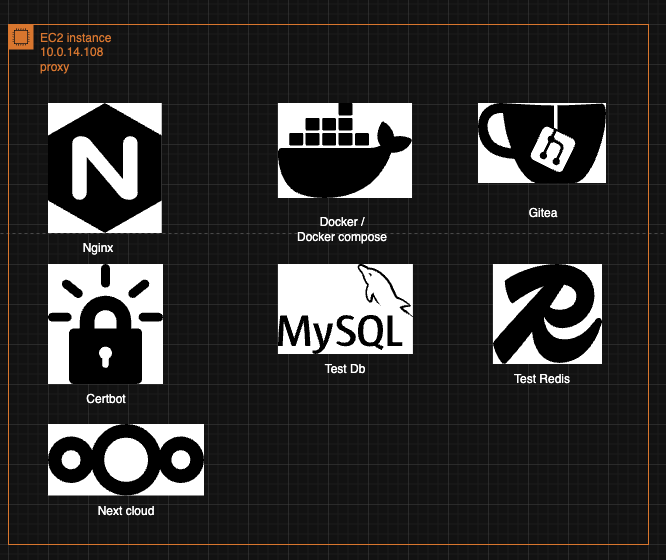
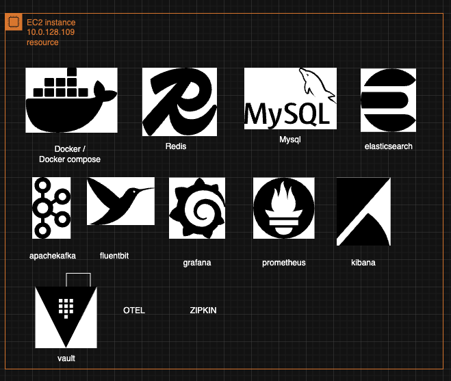
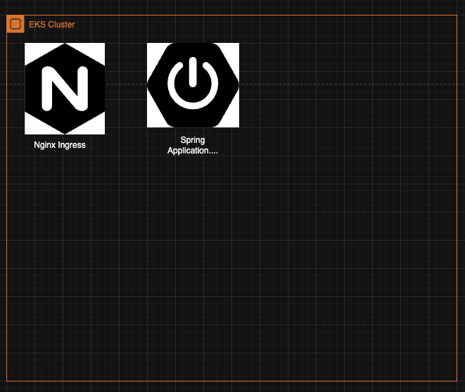
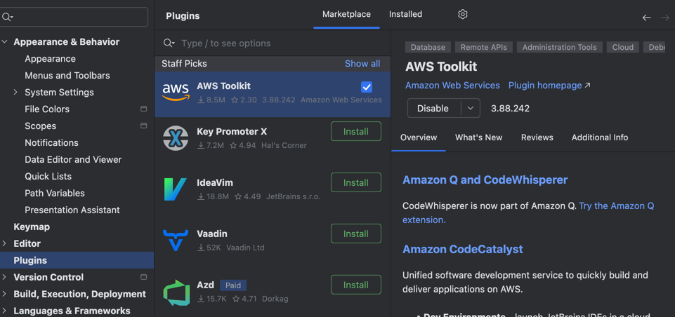
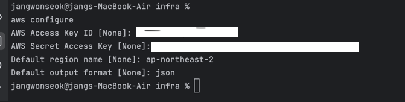
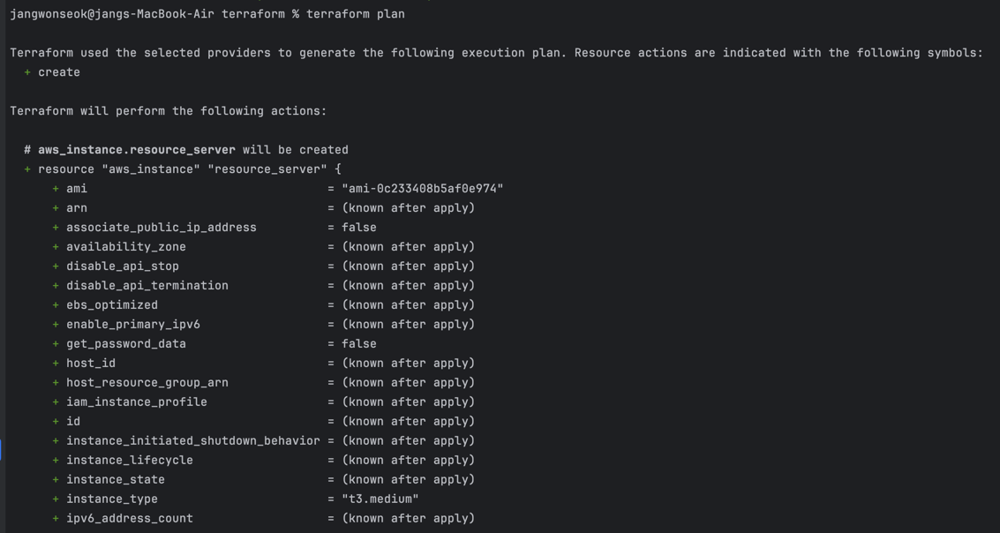
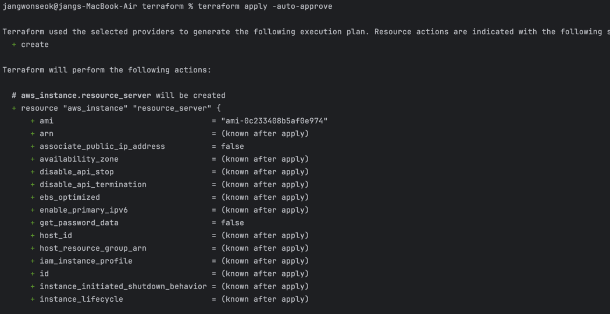
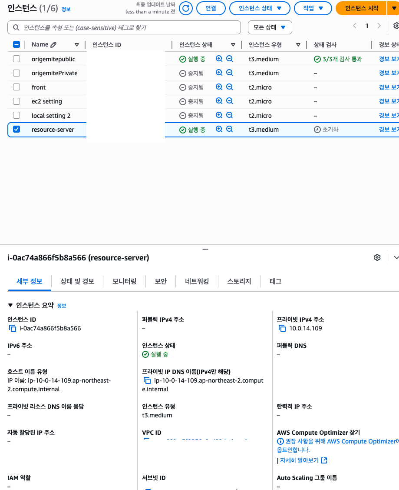
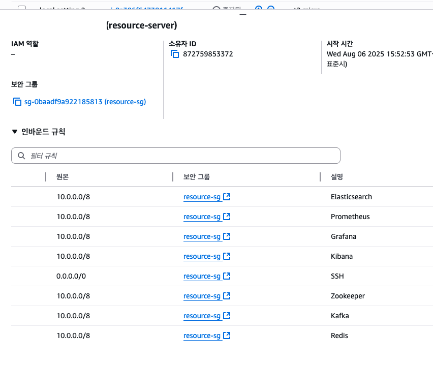

#  Origemite Infrastructure (Terraform)

> **AWS 기반 저비용 포트폴리오 인프라 구성**  
> NAT Gateway / ACM / ALB 제거 → EC2 기반 Proxy + Certbot SSL  
> Route53 도메인 `origemite.com`, 싱글 AZ(`ap-northeast-2a`) 운영

---

## ️ 개요

| 항목            | 내용                                  |
|---------------|-------------------------------------|
| 리전            | ap-northeast-2 (Seoul)              |
| 가용 영역         | ap-northeast-2a *(단일 AZ)*           |
| VPC           | `vpc-00fae3f8256a9cd22`             |
| Subnet        | `subnet-03b2c1c9e27320a03`          |
| 도메인           | origemite.com                       |
| 정적 사이트        | www.origemite.com → S3 Hosting      |
| NAT           | Nat Gateway -> Nat Instance         |
| 인프라 IaC       | Terraform                           |
| 배포 OS         | Ubuntu 24.04 LTS                    |
| Java / Spring | JDK 17 / Spring Boot 3.5.0          |
| DB            | MySQL 10.5                          |
| GIT           | git.origemite.com 개인 소스코드 보관용 깃     |
| nextcloud     | next.origemite.com 개인 문서작성용 컨플루언스대용 |
---

Aws resource


Proxy Instance 



Reource Instance




Eks Cluster




***AWS CLI Infra controller***

plugin install aws


입력후 발급받은 accesskey, secretkey 입력
``` bash
aws configure
```

   
```bash
 aws eks list-clusters --region ap-northeast-2
```
terraform plan


terraform apply -auto-approve


aws 확인

보안그룹 생성확인

