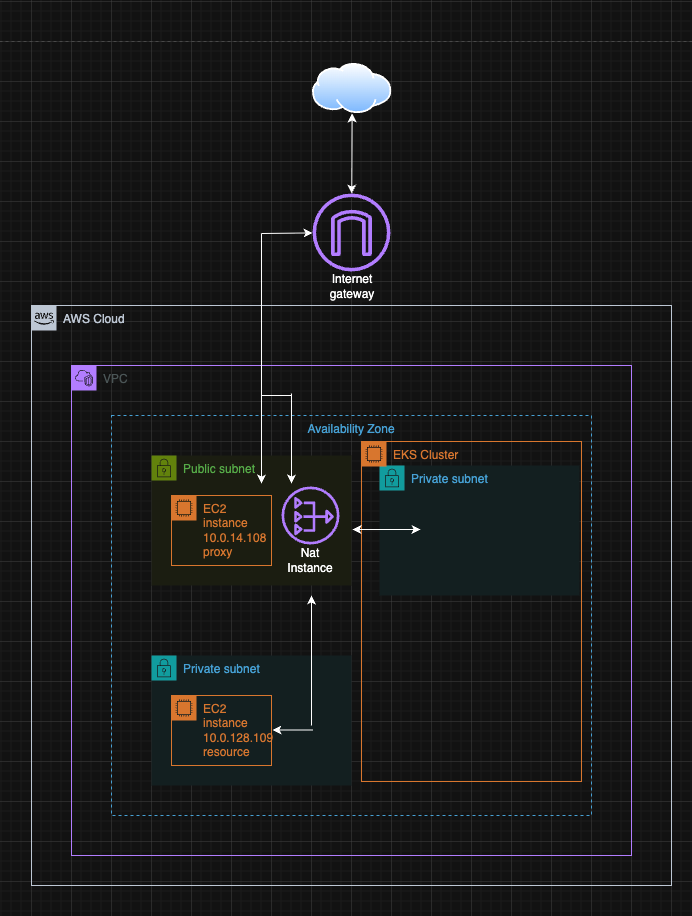

#  Origemite Infrastructure (Terraform)

> **AWS 기반 저비용 포트폴리오 인프라 구성**  
> boot-base 리포의 인프라 프로젝트  
> NAT Gateway / ACM / ALB 제거 → EC2 기반 Proxy + Certbot SSL  
> Route53 도메인 `origemite.com`, 싱글 AZ(`ap-northeast-2a`) 운영

---

## ️ 개요

| 항목            | 내용                                  |
|---------------|-------------------------------------|
| 리전            | ap-northeast-2 (Seoul)              |
| 가용 영역         | ap-northeast-2a *(단일 AZ)*           |
| VPC           | `vpc-00fae3f8256a9cd22`             |
| Subnet        | `subnet-03b2c1c9e27320a03`          |
| 도메인           | origemite.com                       |
| 정적 사이트        | www.origemite.com → S3 Hosting      |
| NAT           | Nat Gateway -> Nat Instance         |
| 인프라 IaC       | Terraform                           |
| 배포 OS         | Ubuntu 24.04 LTS                    |
| Java / Spring | JDK 17 / Spring Boot 3.5.0          |
| DB            | MySQL 10.5                          |
| GIT           | git.origemite.com 개인 소스코드 보관용 깃     |
| nextcloud     | next.origemite.com 개인 문서작성용 컨플루언스대용 |
---

Aws resource


Proxy Instance 


Resource Instance


Eks Cluster


***AWS CLI Infra controller***

plugin install aws


입력후 발급받은 accesskey, secretkey 입력
``` bash
aws configure
```

   
```bash
 aws eks list-clusters --region ap-northeast-2
```
terraform plan


terraform apply -auto-approve


aws 확인

보안그룹 생성확인

테라폼으로 리소스 생성 확인

mysql 리소스서버 도메인 접속 확인

private subnet - resource server

## resource server endpoint 
---
| 서비스                      | 도메인                           | 포트           | 프로토콜         | 프록시 대상               | 블록       | 설명            |
| :----------------------- | :---------------------------- | :----------- | :----------- | :------------------- | :------- | :------------ |
| **MySQL**                | `mysql.origemite.com`         | `3308`       | TCP          | `10.0.128.109:3306`  | `stream` | DB 접속(평문)     |
| **Redis**                | `redis.origemite.com`         | `6380`       | TCP          | `10.0.128.109:6379`  | `stream` | 캐시 서버         |
| **Kafka**                | `kafka.origemite.com`         | `19093`      | TCP          | `10.0.128.109:19092` | `stream` | 메시지 브로커       |
| **RabbitMQ (AMQP)**      | `rabbitmq.origemite.com`      | `5673`       | TCP          | `10.0.128.109:5672`  | `stream` | MQ 통신         |
| **RabbitMQ (UI)**        | `rabbitmq.origemite.com`      | `443`        | HTTPS        | `10.0.128.109:15672` | `http`   | 관리 콘솔         |
| **Fluent Bit (forward)** | `fluentbit.origemite.com`     | `24224`      | TCP/UDP      | `10.0.128.109:24224` | `stream` | 로그 수집 포워드     |
| **OTel (HTTP)**          | `otel.origemite.com`          | `443`        | HTTPS        | `10.0.128.109:4318`  | `http`   | OTLP/HTTP 리시버 |
| **OTel (gRPC)**          | `otel.origemite.com`          | `4317`       | HTTP/2 + TLS | `10.0.128.109:4317`  | `http`   | OTLP/gRPC 리시버 |
| **Elasticsearch**        | `elasticsearch.origemite.com` | `443`        | HTTPS        | `10.0.128.109:9200`  | `http`   | ES API        |
| **Kibana**               | `kibana.origemite.com`        | `443`        | HTTPS        | `10.0.128.109:5601`  | `http`   | ES UI         |
| **Grafana**              | `grafana.origemite.com`       | `443`        | HTTPS        | `10.0.128.109:3000`  | `http`   | 대시보드 UI       |
| **Prometheus**           | `prometheus.origemite.com`    | `443`        | HTTPS        | `10.0.128.109:9090`  | `http`   | 메트릭 수집/쿼리     |
| **Vault (API/UI)**       | `vault.origemite.com`         | `443`        | HTTPS        | `10.0.128.109:8200`  | `http`   | 시크릿 관리        |
| **Zipkin**               | `zipkin.origemite.com`        | `443`        | HTTPS        | `10.0.128.109:9411`  | `http`   | 트레이싱 UI       |
| **Fluent Bit (HTTP 상태)** | `fluentbit.origemite.com`     | `2020`→`443` | HTTPS(리버스)   | `10.0.128.109:2020`  | `http`   | 상태/메트릭 엔드포인트  |

---

# 추후 해볼 것들 (Advanced Roadmap) 
## 아래 항목들은 현재 시스템에 즉시 적용된 기능은 아니며,
## 관련 개념·이론·아키텍처를 학습한 뒤 실제 서비스에 점진적으로 도입하기 위한 로드맵입니다.

## Chaos Engineering (카오스 엔지니어링)
<details><summary><strong>장애 복원력 검증 · 시스템 안정성 테스트</strong></summary>

Chaos Mesh 도입
Pod Kill / Network Delay / CPU Stress 실험
Kafka / Redis 장애 시나리오 테스트
EKS WorkerNode 강제 장애 실험
Auto-Healing 동작 검증
Gateway/Eureka 장애 감지 테스트
K6 부하테스트 + Chaos Mesh 조합 테스트
</details>

## Service Mesh (Istio / Linkerd)
<details><summary><strong>트래픽 안정화 · 보안 강화(mTLS) · 카나리 롤아웃</strong></summary>
Istio 도입
mTLS(서비스 간 암호화) 자동화
Circuit Breaker / Retry 정책
10%/90% 트래픽 분배 기반 Canary Release
서비스 장애 시 자동 우회
Kiali 기반 Mesh 시각화
Linkerd 도입
고성능 Mesh
더 낮은 오버헤드
Kubernetes-native 구성
mTLS 자동 적용
</details>

## 오토스케일링(Auto Scaling) 고도화
<details><summary><strong>트래픽 증가 시 자동 확장 · 비용 최적화</strong></summary>
Horizontal Pod Autoscaler(HPA)
CPU/Memory 기반 Pod 자동 증가/감소
Custom Metrics 기반 자동 확장
Karpenter
트래픽 증가 시 새 노드 자동 생성
Spot + On-Demand 조합
가장 저렴한 인스턴스를 자동 선택
Cluster Autoscaler보다 빠르고 유연함
Cluster Autoscaler
Pod 할당 실패 시 Node 증가
Idle Node 자동 제거
</details>

## Observability 고도화
<details><summary><strong>운영 모니터링 강화 · APM · 장애 감지</strong></summary>
Loki 로그 필터/파이프라인 고도화
Grafana + Tempo(Jaeger 대체) 기반 분산 트레이싱
AlertManager → Slack/Email/Webhook 통합
Uptime Robot / Heartbeat 기반 외부 헬스체크
로그 기반 Anomaly Detection(Prometheus Rule)
</details>

## 보안(Security) 고급 기능
<details><summary><strong>엔터프라이즈급 보안 체계 완성</strong></summary>
Vault Transit Key Rotation 자동화
Vault Agent Injector로 Secret Sidecar 자동 주입
Cognito/Apple Login 연동 구조 추가
Zero Trust Architecture 기반 IAM 재설계
OPA(Open Policy Agent) 기반 권한 평가 서비스
</details>

## 데이터 플랫폼 확장
<details><summary><strong>Streaming · Event Driven Architecture</strong></summary>
Kafka Streams / KSQLDB 분석
Outbox Pattern + Debezium CDC 구조
Elasticsearch → OpenSearch 전환
ClickHouse 기반 로그 분석 파이프라인
Event Sourcing 구조 설계
</details>

## Multi-Region / DR 구성
<details><summary><strong>재해복구 · 고가용성(HA) · 글로벌 서비스 준비</strong></summary>
Active-Passive(2 Region) 구성
Route53 + HealthCheck 기반 자동 Failover
Global Accelerator 연동
Multi-Cluster ArgoCD Sync
Velero Backup/Restore 자동화
</details>

## Developer Experience(DX) 향상
<details><summary><strong>Backstage 개발자 포털 · 자동 템플릿 생성</strong></summary>
Backstage 도입
서비스 템플릿 → 자동 배포 구조 생성
API 문서 자동 수집
배포 이력 + 서비스 상태 통합 페이지
</details>

## 테스트 자동화 & CI/CD 고도화
<details><summary><strong>완전한 GitOps · 품질관리 자동화</strong></summary>
GitHub Actions → GitOps Full Pipeline 구축
Argo Rollouts 자동 Canary + Rollback
Snyk / Trivy 보안 스캔 자동화
테스트 커버리지 + Mutation Testing
Terraform Plan 자동 Review
</details>