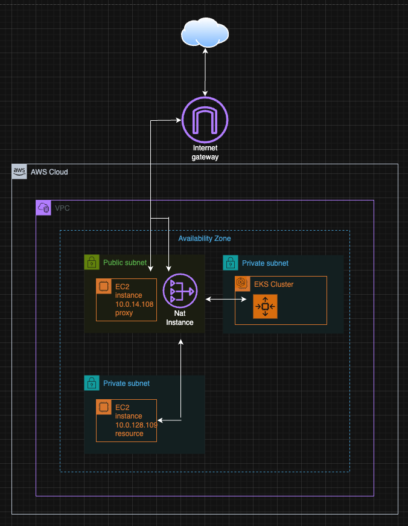
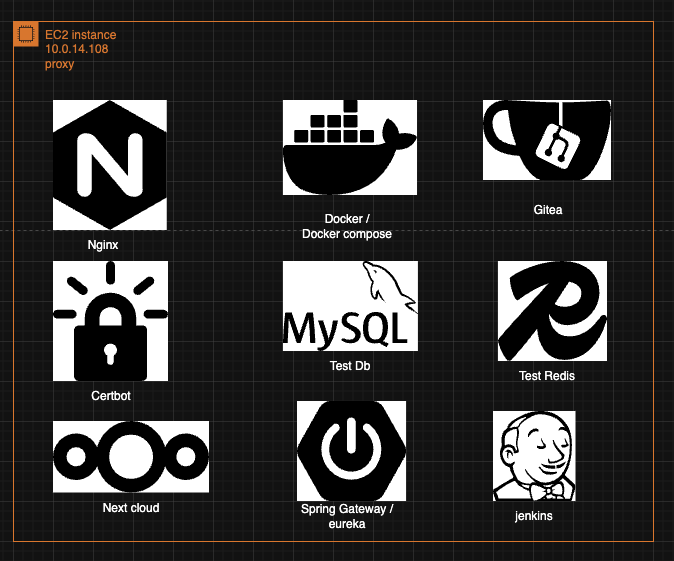

#  Origemite Infrastructure (Terraform)

> **AWS 기반 저비용 포트폴리오 인프라 구성**  
> NAT Gateway / ACM / ALB 제거 → EC2 기반 Proxy + Certbot SSL  
> Route53 도메인 `origemite.com`, 싱글 AZ(`ap-northeast-2a`) 운영

---

## ️ 개요

| 항목            | 내용                                  |
|---------------|-------------------------------------|
| 리전            | ap-northeast-2 (Seoul)              |
| 가용 영역         | ap-northeast-2a *(단일 AZ)*           |
| VPC           | `vpc-00fae3f8256a9cd22`             |
| Subnet        | `subnet-03b2c1c9e27320a03`          |
| 도메인           | origemite.com                       |
| 정적 사이트        | www.origemite.com → S3 Hosting      |
| NAT           | Nat Gateway -> Nat Instance         |
| 인프라 IaC       | Terraform                           |
| 배포 OS         | Ubuntu 24.04 LTS                    |
| Java / Spring | JDK 17 / Spring Boot 3.5.0          |
| DB            | MySQL 10.5                          |
| GIT           | git.origemite.com 개인 소스코드 보관용 깃     |
| nextcloud     | next.origemite.com 개인 문서작성용 컨플루언스대용 |
---

Aws resource



Proxy Instance 



Reource Instance


Eks Cluster


***AWS CLI Infra controller***

plugin install aws


입력후 발급받은 accesskey, secretkey 입력
``` bash
aws configure
```

   
```bash
 aws eks list-clusters --region ap-northeast-2
```
terraform plan


terraform apply -auto-approve


aws 확인

보안그룹 생성확인

테라폼으로 리소스 생성 확인

mysql 리소스서버 도메인 접속 확인

private subnet - resource server

## resource server endpoint 
---
| 서비스                      | 도메인                           | 포트           | 프로토콜         | 프록시 대상               | 블록       | 설명            |
| :----------------------- | :---------------------------- | :----------- | :----------- | :------------------- | :------- | :------------ |
| **MySQL**                | `mysql.origemite.com`         | `3308`       | TCP          | `10.0.128.109:3306`  | `stream` | DB 접속(평문)     |
| **Redis**                | `redis.origemite.com`         | `6380`       | TCP          | `10.0.128.109:6379`  | `stream` | 캐시 서버         |
| **Kafka**                | `kafka.origemite.com`         | `19093`      | TCP          | `10.0.128.109:19092` | `stream` | 메시지 브로커       |
| **RabbitMQ (AMQP)**      | `rabbitmq.origemite.com`      | `5673`       | TCP          | `10.0.128.109:5672`  | `stream` | MQ 통신         |
| **RabbitMQ (UI)**        | `rabbitmq.origemite.com`      | `443`        | HTTPS        | `10.0.128.109:15672` | `http`   | 관리 콘솔         |
| **Fluent Bit (forward)** | `fluentbit.origemite.com`     | `24224`      | TCP/UDP      | `10.0.128.109:24224` | `stream` | 로그 수집 포워드     |
| **OTel (HTTP)**          | `otel.origemite.com`          | `443`        | HTTPS        | `10.0.128.109:4318`  | `http`   | OTLP/HTTP 리시버 |
| **OTel (gRPC)**          | `otel.origemite.com`          | `4317`       | HTTP/2 + TLS | `10.0.128.109:4317`  | `http`   | OTLP/gRPC 리시버 |
| **Elasticsearch**        | `elasticsearch.origemite.com` | `443`        | HTTPS        | `10.0.128.109:9200`  | `http`   | ES API        |
| **Kibana**               | `kibana.origemite.com`        | `443`        | HTTPS        | `10.0.128.109:5601`  | `http`   | ES UI         |
| **Grafana**              | `grafana.origemite.com`       | `443`        | HTTPS        | `10.0.128.109:3000`  | `http`   | 대시보드 UI       |
| **Prometheus**           | `prometheus.origemite.com`    | `443`        | HTTPS        | `10.0.128.109:9090`  | `http`   | 메트릭 수집/쿼리     |
| **Vault (API/UI)**       | `vault.origemite.com`         | `443`        | HTTPS        | `10.0.128.109:8200`  | `http`   | 시크릿 관리        |
| **Zipkin**               | `zipkin.origemite.com`        | `443`        | HTTPS        | `10.0.128.109:9411`  | `http`   | 트레이싱 UI       |
| **Fluent Bit (HTTP 상태)** | `fluentbit.origemite.com`     | `2020`→`443` | HTTPS(리버스)   | `10.0.128.109:2020`  | `http`   | 상태/메트릭 엔드포인트  |

---

